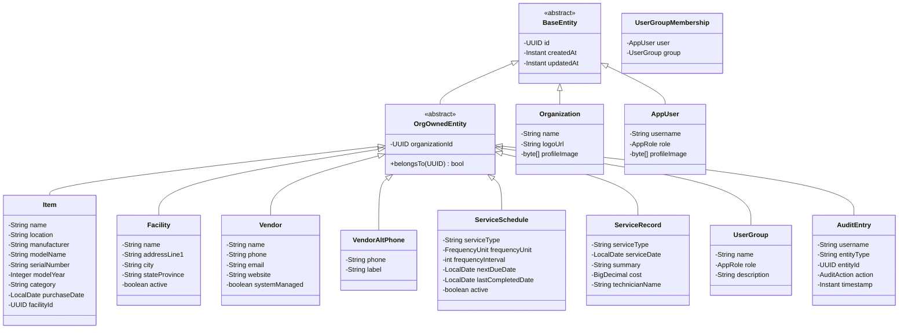
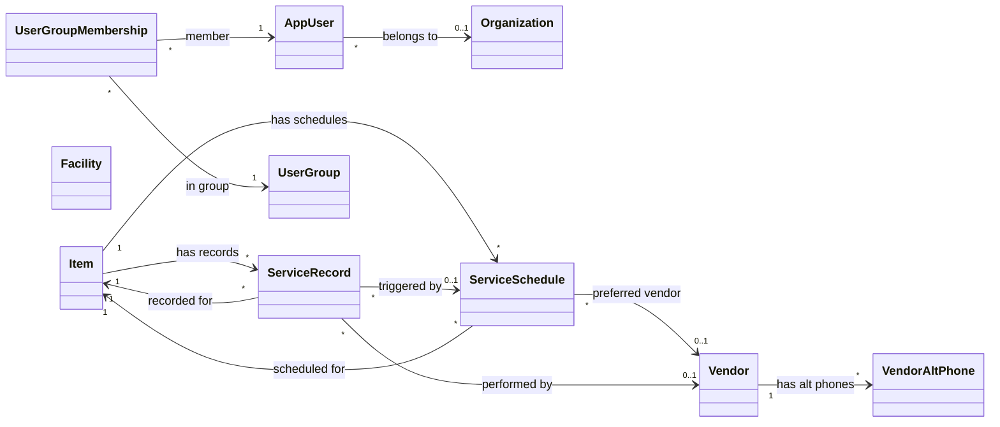
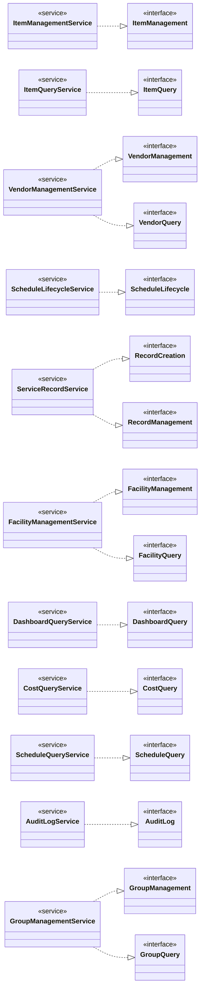
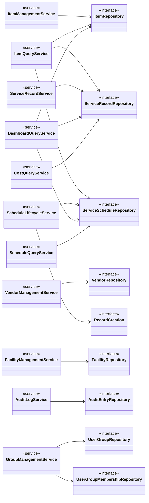
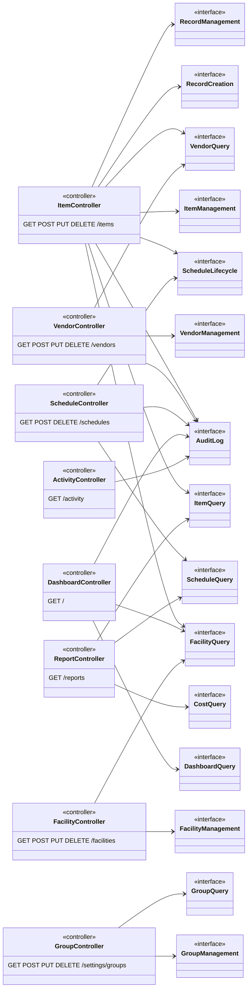
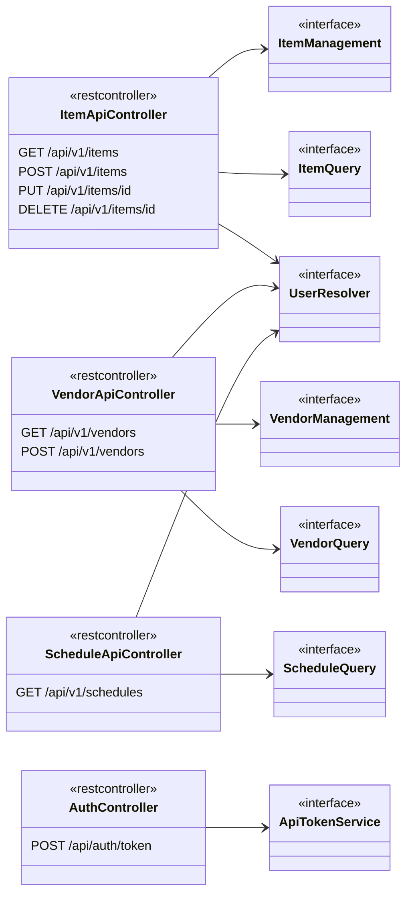
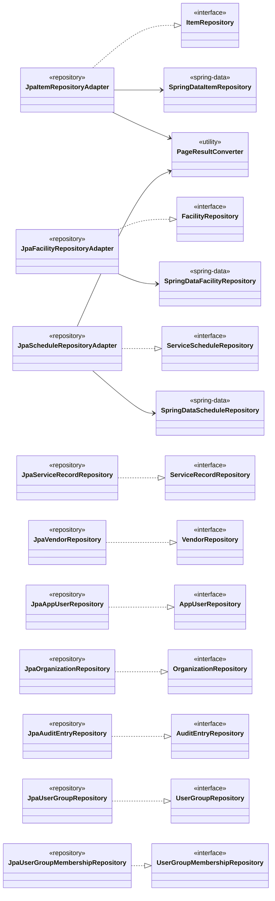

# Maintainly — Class Diagrams

Separated into printable sections. Each diagram renders independently on GitHub.

---

## 1. Domain Model — Entity Hierarchy

---

## 2. Domain Model — Entity Relationships

---

## 3. Enums and Value Objects

```mermaid
classDiagram
    direction TB

    class FrequencyUnit {
        <<enum>>
        days
        weeks
        months
        years
        +advance(LocalDate, int) LocalDate
    }

    class AppRole {
        <<enum>>
        ADMIN
        FACILITY_MANAGER
        TECHNICIAN
        VIEWER
    }

    class AuditAction {
        <<enum>>
        CREATE
        UPDATE
        DELETE
        COMPLETE
        SKIP
    }

    class ItemSpec {
        <<record>>
        +String name
        +String location
        +String category
        +Integer modelYear
        +UUID facilityId
    }

    class VendorData {
        <<record>>
        +String name
        +String phone
        +String email
    }

    class FacilityData {
        <<record>>
        +String name
        +String addressLine1
        +String city
    }

    class ServiceCompletion {
        <<record>>
        +Vendor vendor
        +String summary
        +LocalDate serviceDate
        +BigDecimal cost
    }

    class PageRequest {
        <<record>>
        +int page
        +int size
        +String sort
        +String dir
    }

    class PageResult~T~ {
        <<record>>
        +List~T~ content
        +int page
        +int size
        +boolean hasNext
    }

    class ItemCostSummary {
        <<record>>
        +UUID itemId
        +String itemName
        +BigDecimal totalCost
    }

    class FacilitySummary {
        <<record>>
        +UUID facilityId
        +String facilityName
        +long itemCount
        +long overdueCount
    }

    class Validation {
        <<utility>>
        +requireNotBlank()$
        +requireMaxLength()$
        +trimOrNull()$
        +requireYearInRange()$
        +requireNonNegative()$
        +requireValidEmail()$
    }
```

---

## 4. Inbound Ports (Use Cases)

```mermaid
classDiagram
    direction TB

    class ItemManagement {
        <<interface>>
        +createItem(UUID, ItemSpec) Item
        +updateItem(UUID, UUID, ItemSpec) Item
        +deleteItem(UUID, UUID)
        +bulkDelete(UUID, List~UUID~)
        +bulkUpdateCategory(UUID, List~UUID~, String)
    }

    class ItemQuery {
        <<interface>>
        +findItems(UUID, String, String, PageRequest) PageResult
        +findByOrganization(UUID, PageRequest) PageResult
        +findDistinctCategories(UUID) List~String~
        +findByIdAndOrganization(UUID, UUID) Optional
    }

    class VendorManagement {
        <<interface>>
        +createVendor(UUID, VendorData) Vendor
        +updateVendor(UUID, UUID, VendorData) Vendor
        +deleteVendor(UUID, UUID)
    }

    class VendorQuery {
        <<interface>>
        +findAllVendors(UUID) List~Vendor~
        +findVendor(UUID, UUID) Optional
    }

    class ScheduleLifecycle {
        <<interface>>
        +createSchedule(...) ServiceSchedule
        +completeSchedule(UUID, UUID, ServiceCompletion) ServiceSchedule
        +skipSchedule(UUID, UUID) ServiceSchedule
        +deactivateSchedule(UUID, UUID)
    }

    class ScheduleQuery {
        <<interface>>
        +findActiveByOrganization(UUID, int, int) PageResult
        +findAllActiveByOrganization(UUID) List
    }

    class RecordCreation {
        <<interface>>
        +createRecord(UUID, Item, ServiceSchedule, ServiceCompletion)
    }

    class RecordManagement {
        <<interface>>
        +updateRecord(...) ServiceRecord
        +deleteRecord(UUID, UUID)
    }

    class FacilityManagement {
        <<interface>>
        +createFacility(UUID, FacilityData) Facility
        +updateFacility(UUID, UUID, FacilityData) Facility
        +deleteFacility(UUID, UUID)
    }

    class FacilityQuery {
        <<interface>>
        +findAllFacilities(UUID) List~Facility~
        +findFacility(UUID, UUID) Optional
    }

    class DashboardQuery {
        <<interface>>
        +countOverdueSchedules(UUID, LocalDate) long
        +countDueSoonSchedules(UUID, LocalDate, LocalDate) long
        +countItems(UUID) long
        +findRecentRecords(UUID, int) List
    }

    class CostQuery {
        <<interface>>
        +totalSpendForYear(UUID, int) BigDecimal
        +totalSpendAllTime(UUID) BigDecimal
        +topItemsByCost(UUID, int) List
    }

    class AuditLog {
        <<interface>>
        +log(UUID, String, String, UUID, String, AuditAction, String)
        +findRecentByOrganization(UUID, int) List
        +findByEntityId(UUID) List
    }

    class GroupManagement {
        <<interface>>
        +createGroup(UUID, String, AppRole, String) UserGroup
        +deleteGroup(UUID, UUID)
        +addMember(UUID, UUID, UUID)
        +removeMember(UUID, UUID, UUID)
    }

    class GroupQuery {
        <<interface>>
        +findAllGroups(UUID) List~UserGroup~
    }

    class ProfileImageUpload {
        <<interface>>
        +saveOrganizationImage(UUID, byte[], String)
        +saveUserImage(UUID, byte[], String)
    }

    class UserResolver {
        <<interface>>
        +resolveOrCreate(String) AppUser
    }
```

---

## 5. Outbound Ports (Repositories)

```mermaid
classDiagram
    direction TB

    class ItemRepository {
        <<interface>>
        +findByOrganizationId(UUID, PageRequest) PageResult
        +searchByOrganizationId(UUID, String, PageRequest) PageResult
        +findByIdAndOrganizationId(UUID, UUID) Optional
        +findDistinctCategoriesByOrganizationId(UUID) List
        +save(Item) Item
        +deleteByIdAndOrganizationId(UUID, UUID)
    }

    class VendorRepository {
        <<interface>>
        +findByOrganizationId(UUID) List
        +findByIdAndOrganizationId(UUID, UUID) Optional
        +save(Vendor) Vendor
        +deleteByIdAndOrganizationId(UUID, UUID)
    }

    class ServiceScheduleRepository {
        <<interface>>
        +findActiveByOrganizationId(UUID) List
        +findByIdAndOrganizationId(UUID, UUID) Optional
        +countActiveBeforeDate(UUID, LocalDate) long
        +countActiveBetweenDates(UUID, LocalDate, LocalDate) long
        +save(ServiceSchedule) ServiceSchedule
    }

    class ServiceRecordRepository {
        <<interface>>
        +findByItemIdAndOrganizationId(UUID, UUID) List
        +findRecentByOrganizationId(UUID, int) List
        +save(ServiceRecord) ServiceRecord
        +deleteByIdAndOrganizationId(UUID, UUID)
        +sumCostByOrganization(UUID) BigDecimal
    }

    class FacilityRepository {
        <<interface>>
        +findByOrganizationId(UUID) List
        +findByIdAndOrganizationId(UUID, UUID) Optional
        +save(Facility) Facility
        +deleteByIdAndOrganizationId(UUID, UUID)
    }

    class AuditEntryRepository {
        <<interface>>
        +save(AuditEntry) AuditEntry
        +findRecentByOrganizationId(UUID, int) List
        +findByEntityId(UUID) List
    }

    class AppUserRepository {
        <<interface>>
        +findByUsername(String) Optional
        +save(AppUser) AppUser
    }

    class OrganizationRepository {
        <<interface>>
        +findById(UUID) Optional
        +save(Organization) Organization
    }

    class UserGroupRepository {
        <<interface>>
        +findByOrganizationId(UUID) List
        +save(UserGroup) UserGroup
    }

    class UserGroupMembershipRepository {
        <<interface>>
        +findByGroupId(UUID) List
        +save(UserGroupMembership)
    }
```

---

## 6. Domain Services — Port Implementation

---

## 7. Domain Services — Repository Dependencies

---

## 8. Application Layer — Controllers and Port Dependencies

---

## 9. REST API Controllers

---

## 10. Infrastructure — JPA Adapters

