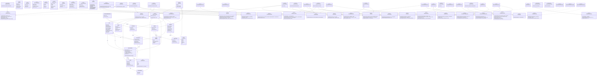

# Maintainly — Class Diagram

```mermaid
classDiagram
    direction TB

    %% ═══════════════════════════════════════
    %% DOMAIN MODEL — Entities
    %% ═══════════════════════════════════════

    class BaseEntity {
        <<abstract>>
        -UUID id
        -Instant createdAt
        -Instant updatedAt
    }

    class OrgOwnedEntity {
        <<abstract>>
        -UUID organizationId
        +belongsTo(UUID) bool
    }

    class Organization {
        -String name
        -String logoUrl
        -byte[] profileImage
    }

    class AppUser {
        -String username
        -AppRole role
        -byte[] profileImage
    }

    class Item {
        -String name
        -String location
        -String manufacturer
        -String modelName
        -String serialNumber
        -Integer modelYear
        -String category
        -LocalDate purchaseDate
        -UUID facilityId
        -String notes
    }

    class Facility {
        -String name
        -String addressLine1
        -String city
        -String stateProvince
        -boolean active
    }

    class Vendor {
        -String name
        -String phone
        -String email
        -String website
        -boolean systemManaged
    }

    class VendorAltPhone {
        -String phone
        -String label
    }

    class ServiceSchedule {
        -String serviceType
        -FrequencyUnit frequencyUnit
        -int frequencyInterval
        -LocalDate nextDueDate
        -LocalDate lastCompletedDate
        -boolean active
        +advanceNextDueDate(LocalDate)
    }

    class ServiceRecord {
        -String serviceType
        -LocalDate serviceDate
        -String summary
        -BigDecimal cost
        -String technicianName
    }

    class UserGroup {
        -String name
        -AppRole role
        -String description
    }

    class UserGroupMembership {
        -AppUser user
        -UserGroup group
    }

    class AuditEntry {
        -String username
        -String entityType
        -UUID entityId
        -String entityName
        -AuditAction action
        -String details
        -Instant timestamp
    }

    %% Enums
    class FrequencyUnit {
        <<enum>>
        days
        weeks
        months
        years
        +advance(LocalDate, int) LocalDate
    }

    class AppRole {
        <<enum>>
        ADMIN
        FACILITY_MANAGER
        TECHNICIAN
        VIEWER
    }

    class AuditAction {
        <<enum>>
        CREATE
        UPDATE
        DELETE
        COMPLETE
        SKIP
    }

    %% Records / Value Objects
    class ItemSpec {
        <<record>>
        +String name
        +String location
        +String category
        +Integer modelYear
        +UUID facilityId
    }

    class VendorData {
        <<record>>
        +String name
        +String phone
        +String email
    }

    class ServiceCompletion {
        <<record>>
        +Vendor vendor
        +String summary
        +LocalDate serviceDate
        +BigDecimal cost
    }

    class PageRequest {
        <<record>>
        +int page
        +int size
        +String sort
        +String dir
    }

    class PageResult~T~ {
        <<record>>
        +List~T~ content
        +int page
        +int size
        +boolean hasNext
        +String sort
        +String dir
    }

    class FacilityData {
        <<record>>
        +String name
        +String addressLine1
        +String city
    }

    class FacilitySummary {
        <<record>>
        +UUID facilityId
        +String facilityName
        +long itemCount
        +long overdueCount
    }

    class ItemCostSummary {
        <<record>>
        +UUID itemId
        +String itemName
        +BigDecimal totalCost
    }

    %% Utilities
    class Validation {
        <<utility>>
        +requireNotBlank()$
        +requireMaxLength()$
        +trimOrNull()$
        +requireYearInRange()$
        +requireNonNegative()$
        +requireValidEmail()$
    }

    %% ═══════════════════════════════════════
    %% INHERITANCE
    %% ═══════════════════════════════════════

    BaseEntity <|-- OrgOwnedEntity
    BaseEntity <|-- Organization
    BaseEntity <|-- AppUser
    OrgOwnedEntity <|-- Item
    OrgOwnedEntity <|-- Facility
    OrgOwnedEntity <|-- Vendor
    OrgOwnedEntity <|-- VendorAltPhone
    OrgOwnedEntity <|-- ServiceSchedule
    OrgOwnedEntity <|-- ServiceRecord
    OrgOwnedEntity <|-- UserGroup
    OrgOwnedEntity <|-- AuditEntry

    %% ═══════════════════════════════════════
    %% ENTITY RELATIONSHIPS
    %% ═══════════════════════════════════════

    AppUser "*" --> "0..1" Organization : belongs to
    Item "1" --> "*" ServiceSchedule : has
    Item "1" --> "*" ServiceRecord : has
    Vendor "1" --> "*" VendorAltPhone : has
    ServiceSchedule "*" --> "1" Item : for
    ServiceSchedule "*" --> "0..1" Vendor : preferred
    ServiceRecord "*" --> "1" Item : for
    ServiceRecord "*" --> "0..1" Vendor : by
    ServiceRecord "*" --> "0..1" ServiceSchedule : from
    UserGroupMembership "*" --> "1" AppUser : member
    UserGroupMembership "*" --> "1" UserGroup : in
    UserGroup --> AppRole : has role
    AppUser --> AppRole : has role
    AuditEntry --> AuditAction : records
    ServiceSchedule --> FrequencyUnit : uses

    %% ═══════════════════════════════════════
    %% INBOUND PORTS (Use Cases)
    %% ═══════════════════════════════════════

    class ItemManagement {
        <<interface>>
        +createItem(UUID, ItemSpec) Item
        +updateItem(UUID, UUID, ItemSpec) Item
        +deleteItem(UUID, UUID)
        +bulkDelete(UUID, List~UUID~)
        +bulkUpdateCategory(UUID, List~UUID~, String)
    }

    class ItemQuery {
        <<interface>>
        +findItems(UUID, String, String, PageRequest) PageResult
        +findByOrganization(UUID, PageRequest) PageResult
        +findDistinctCategories(UUID) List~String~
        +findByIdAndOrganization(UUID, UUID) Optional~Item~
    }

    class VendorManagement {
        <<interface>>
        +createVendor(UUID, VendorData) Vendor
        +updateVendor(UUID, UUID, VendorData) Vendor
        +deleteVendor(UUID, UUID)
    }

    class VendorQuery {
        <<interface>>
        +findAllVendors(UUID) List~Vendor~
        +findVendor(UUID, UUID) Optional~Vendor~
    }

    class ScheduleLifecycle {
        <<interface>>
        +createSchedule(...) ServiceSchedule
        +completeSchedule(UUID, UUID, ServiceCompletion) ServiceSchedule
        +skipSchedule(UUID, UUID) ServiceSchedule
        +deactivateSchedule(UUID, UUID)
    }

    class RecordCreation {
        <<interface>>
        +createRecord(UUID, Item, ServiceSchedule, ServiceCompletion)
    }

    class RecordManagement {
        <<interface>>
        +updateRecord(UUID, UUID, String, LocalDate, String, BigDecimal) ServiceRecord
        +deleteRecord(UUID, UUID)
    }

    class FacilityManagement {
        <<interface>>
        +createFacility(UUID, FacilityData) Facility
        +updateFacility(UUID, UUID, FacilityData) Facility
        +deleteFacility(UUID, UUID)
    }

    class FacilityQuery {
        <<interface>>
        +findAllFacilities(UUID) List~Facility~
        +findFacility(UUID, UUID) Optional~Facility~
    }

    class DashboardQuery {
        <<interface>>
        +countOverdueSchedules(UUID, LocalDate) long
        +countDueSoonSchedules(UUID, LocalDate, LocalDate) long
        +countItems(UUID) long
        +findRecentRecords(UUID, int) List~ServiceRecord~
    }

    class CostQuery {
        <<interface>>
        +totalSpendForYear(UUID, int) BigDecimal
        +totalSpendAllTime(UUID) BigDecimal
        +topItemsByCost(UUID, int) List~ItemCostSummary~
    }

    class ScheduleQuery {
        <<interface>>
        +findActiveByOrganization(UUID, int, int) PageResult
        +findAllActiveByOrganization(UUID) List
    }

    class AuditLog {
        <<interface>>
        +log(UUID, String, String, UUID, String, AuditAction, String)
        +findRecentByOrganization(UUID, int) List~AuditEntry~
        +findByEntityId(UUID) List~AuditEntry~
    }

    class GroupManagement {
        <<interface>>
        +createGroup(UUID, String, AppRole, String) UserGroup
        +updateGroup(UUID, UUID, String, AppRole, String)
        +deleteGroup(UUID, UUID)
        +addMember(UUID, UUID, UUID)
        +removeMember(UUID, UUID, UUID)
    }

    class GroupQuery {
        <<interface>>
        +findAllGroups(UUID) List~UserGroup~
    }

    class ProfileImageUpload {
        <<interface>>
        +saveOrganizationImage(UUID, byte[], String)
        +saveUserImage(UUID, byte[], String)
    }

    class UserResolver {
        <<interface>>
        +resolveOrCreate(String) AppUser
    }

    %% ═══════════════════════════════════════
    %% OUTBOUND PORTS (Repositories)
    %% ═══════════════════════════════════════

    class ItemRepository {
        <<interface>>
        +findByOrganizationId(UUID, PageRequest) PageResult
        +save(Item) Item
        +deleteByIdAndOrganizationId(UUID, UUID)
    }

    class VendorRepository {
        <<interface>>
        +findByOrganizationId(UUID) List~Vendor~
        +save(Vendor) Vendor
        +deleteByIdAndOrganizationId(UUID, UUID)
    }

    class ServiceScheduleRepository {
        <<interface>>
        +findActiveByOrganizationId(UUID) List
        +countActiveBeforeDate(UUID, LocalDate) long
        +save(ServiceSchedule) ServiceSchedule
    }

    class ServiceRecordRepository {
        <<interface>>
        +findByItemIdAndOrganizationId(UUID, UUID) List
        +save(ServiceRecord) ServiceRecord
        +sumCostByOrganization(UUID) BigDecimal
    }

    class FacilityRepository {
        <<interface>>
        +findByOrganizationId(UUID) List~Facility~
        +save(Facility) Facility
        +deleteByIdAndOrganizationId(UUID, UUID)
    }

    class AuditEntryRepository {
        <<interface>>
        +save(AuditEntry) AuditEntry
        +findRecentByOrganizationId(UUID, int) List
        +findByEntityId(UUID) List
    }

    %% ═══════════════════════════════════════
    %% DOMAIN SERVICES
    %% ═══════════════════════════════════════

    class ItemManagementService {
        <<service>>
    }
    class ItemQueryService {
        <<service>>
    }
    class VendorManagementService {
        <<service>>
    }
    class ScheduleLifecycleService {
        <<service>>
    }
    class ServiceRecordService {
        <<service>>
    }
    class FacilityManagementService {
        <<service>>
    }
    class DashboardQueryService {
        <<service>>
    }
    class CostQueryService {
        <<service>>
    }
    class ScheduleQueryService {
        <<service>>
    }
    class AuditLogService {
        <<service>>
    }
    class GroupManagementService {
        <<service>>
    }

    %% Service implements Port
    ItemManagementService ..|> ItemManagement
    ItemQueryService ..|> ItemQuery
    VendorManagementService ..|> VendorManagement
    VendorManagementService ..|> VendorQuery
    ScheduleLifecycleService ..|> ScheduleLifecycle
    ServiceRecordService ..|> RecordCreation
    ServiceRecordService ..|> RecordManagement
    FacilityManagementService ..|> FacilityManagement
    FacilityManagementService ..|> FacilityQuery
    DashboardQueryService ..|> DashboardQuery
    CostQueryService ..|> CostQuery
    ScheduleQueryService ..|> ScheduleQuery
    AuditLogService ..|> AuditLog
    GroupManagementService ..|> GroupManagement
    GroupManagementService ..|> GroupQuery

    %% Service depends on Repository
    ItemManagementService --> ItemRepository
    ItemQueryService --> ItemRepository
    ItemQueryService --> ServiceRecordRepository
    ItemQueryService --> ServiceScheduleRepository
    VendorManagementService --> VendorRepository
    ScheduleLifecycleService --> ServiceScheduleRepository
    ScheduleLifecycleService --> RecordCreation
    ServiceRecordService --> ServiceRecordRepository
    FacilityManagementService --> FacilityRepository
    DashboardQueryService --> ServiceScheduleRepository
    DashboardQueryService --> ItemRepository
    DashboardQueryService --> ServiceRecordRepository
    CostQueryService --> ServiceRecordRepository
    ScheduleQueryService --> ServiceScheduleRepository
    AuditLogService --> AuditEntryRepository

    %% ═══════════════════════════════════════
    %% APPLICATION LAYER — Controllers
    %% ═══════════════════════════════════════

    class ItemController {
        <<controller>>
        GET POST PUT DELETE /items
    }
    class VendorController {
        <<controller>>
        GET POST PUT DELETE /vendors
    }
    class ScheduleController {
        <<controller>>
        GET POST DELETE /schedules
    }
    class DashboardController {
        <<controller>>
        GET /
    }
    class ReportController {
        <<controller>>
        GET /reports
    }
    class FacilityController {
        <<controller>>
        GET POST PUT DELETE /facilities
    }
    class GroupController {
        <<controller>>
        GET POST PUT DELETE /settings/groups
    }
    class ActivityController {
        <<controller>>
        GET /activity
    }
    class ItemApiController {
        <<restcontroller>>
        GET POST PUT DELETE /api/v1/items
    }
    class VendorApiController {
        <<restcontroller>>
        GET POST /api/v1/vendors
    }
    class ScheduleApiController {
        <<restcontroller>>
        GET /api/v1/schedules
    }

    %% Controllers depend on Inbound Ports
    ItemController --> ItemManagement
    ItemController --> ItemQuery
    ItemController --> RecordCreation
    ItemController --> RecordManagement
    ItemController --> ScheduleLifecycle
    ItemController --> VendorQuery
    ItemController --> AuditLog
    ItemController --> FacilityQuery
    VendorController --> VendorManagement
    VendorController --> VendorQuery
    VendorController --> AuditLog
    ScheduleController --> ScheduleLifecycle
    ScheduleController --> ScheduleQuery
    ScheduleController --> AuditLog
    DashboardController --> DashboardQuery
    DashboardController --> FacilityQuery
    DashboardController --> AuditLog
    ReportController --> ItemQuery
    ReportController --> ScheduleQuery
    ReportController --> CostQuery
    FacilityController --> FacilityManagement
    FacilityController --> FacilityQuery
    GroupController --> GroupManagement
    GroupController --> GroupQuery
    ActivityController --> AuditLog
    ItemApiController --> ItemManagement
    ItemApiController --> ItemQuery

    %% ═══════════════════════════════════════
    %% INFRASTRUCTURE — JPA Adapters
    %% ═══════════════════════════════════════

    class JpaItemRepositoryAdapter {
        <<repository>>
    }
    class JpaFacilityRepositoryAdapter {
        <<repository>>
    }
    class JpaScheduleRepositoryAdapter {
        <<repository>>
    }

    JpaItemRepositoryAdapter ..|> ItemRepository
    JpaFacilityRepositoryAdapter ..|> FacilityRepository
    JpaScheduleRepositoryAdapter ..|> ServiceScheduleRepository
```
